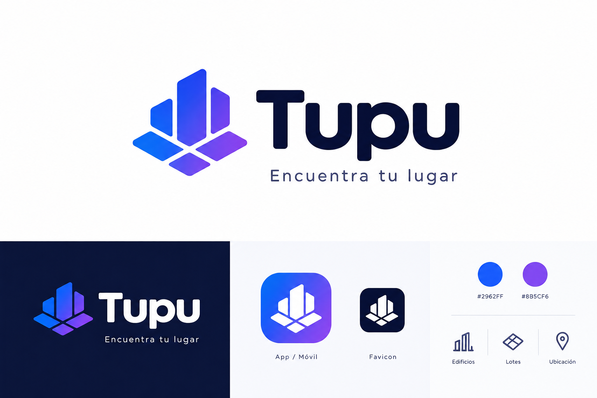

# Guia de identidad visual - Tupu

Version 1.0 · Identidad de marca · PropTech



La identidad de Tupu combina tecnologia, ubicacion y espacios inmobiliarios. La marca debe sentirse moderna, confiable y reconocible, con un degradado azul-violeta como recurso distintivo, una tipografia geometrica y un simbolo inspirado en edificios, lotes y ubicacion vistos desde arriba.

Esta guia esta pensada para implementar la identidad en la web, favicon, aplicacion movil, publicaciones y futuras herramientas inmobiliarias.

## 1. Paleta de colores oficial

Los colores deben mantenerse como variables centrales del producto. Evita introducir tonos similares sin una razon funcional clara, especialmente en componentes principales, acciones y fondos.

| Color | Token sugerido | HEX | RGB | HSL | Uso principal |
| --- | --- | --- | --- | --- | --- |
| Azul electrico | `--tupu-primary` | `#2962FF` | `41, 98, 255` | `225deg, 100%, 58%` | Botones, enlaces, acciones, graficos y elementos interactivos. |
| Violeta | `--tupu-secondary` | `#8B5CF6` | `139, 92, 246` | `258deg, 90%, 66%` | Degradados, detalles de marca, acentos e ilustraciones. |
| Azul noche | `--tupu-dark` | `#0B1230` | `11, 18, 48` | - | Logotipo sobre fondos claros, textos destacados, navegacion y modo oscuro. |
| Blanco frio | `--tupu-background` | `#F8FAFC` | `248, 250, 252` | - | Fondo principal de la web, tarjetas de propiedades y paneles. |
| Gris pizarra | `--tupu-text-secondary` | `#64748B` | `100, 116, 139` | - | Descripciones, ubicaciones, metadatos y textos secundarios. |

## 2. Degradado oficial de Tupu

El degradado es el principal recurso visual de la marca. Debe evocar un producto tecnologico sin dificultar la lectura ni competir con las fotografias de los inmuebles.

### Degradado principal

Azul electrico -> azul-violeta -> violeta

```css
linear-gradient(115deg, #2962FF 0%, #5B4AF4 55%, #8B5CF6 100%)
```

Usalo en el simbolo, elementos de identidad, estados destacados y piezas visuales donde la marca necesite estar claramente presente.

### Degradados complementarios

**Gradiente compacto**

```css
linear-gradient(135deg, #2962FF 0%, #8B5CF6 100%)
```

Para botones, iconos, pequenos acentos, estados activos y elementos de interfaz de baja superficie.

**Gradiente nocturno**

```css
linear-gradient(135deg, #0B1230 0%, #2962FF 65%, #8B5CF6 100%)
```

Para banners, portadas, secciones destacadas y fondos oscuros de alto impacto.

### Reglas de uso

- Prioriza el degradado principal en el simbolo y los elementos centrales de identidad.
- Utiliza azul solido en botones y acciones cuando la claridad sea mas importante que el efecto visual.
- Evita aplicar degradados a todos los textos, tarjetas y fondos al mismo tiempo.
- No uses el degradado como fondo de textos pequenos si el contraste no es suficiente.
- En interfaces inmobiliarias, deja que las fotografias de propiedades respiren; el degradado debe acompanar, no competir.

## 3. Logotipo y simbolo

El logotipo de Tupu se compone de un simbolo geometrico y un wordmark oscuro. El simbolo representa tres ideas centrales:

- **Edificios:** volumenes verticales que sugieren desarrollo urbano.
- **Lotes:** piezas modulares vistas desde arriba.
- **Ubicacion:** composicion central que remite a mapas, coordenadas y busqueda.

El wordmark debe conservar un peso visual fuerte, con terminaciones redondeadas y una sensacion tecnologica accesible. En fondos claros, usa el logotipo en azul noche. En fondos oscuros, usa la version blanca del wordmark junto al simbolo en degradado.

## 4. Aplicaciones principales

### Web

Usa el fondo blanco frio para pantallas generales, azul noche para navegacion o textos de alta jerarquia y azul electrico para acciones primarias. El degradado debe aparecer en momentos de identidad, no como decoracion constante.

### Favicon

El favicon debe usar el simbolo simplificado sobre fondo azul noche o sobre un contenedor con degradado compacto. Evita incluir el texto "Tupu" en tamanos pequenos.

### Aplicacion movil

Para icono de app, usa el simbolo blanco sobre fondo con degradado compacto. El contenedor puede tener esquinas redondeadas amplias, como se muestra en la referencia visual.

### Publicaciones

En piezas sociales o comerciales, combina fotografias inmobiliarias con pequenas areas de marca. El degradado funciona bien para cintillos, sellos, iconos, llamadas de accion y separadores.

## 5. Variables CSS recomendadas

```css
:root {
  /* Colors */
  --tupu-primary: #2962FF;
  --tupu-secondary: #8B5CF6;
  --tupu-dark: #0B1230;
  --tupu-background: #F8FAFC;
  --tupu-text-secondary: #64748B;
  --tupu-text-inverse: #FFFFFF;

  /* Gradients */
  --tupu-gradient: linear-gradient(115deg, #2962FF 0%, #5B4AF4 55%, #8B5CF6 100%);
  --tupu-gradient-compact: linear-gradient(135deg, #2962FF 0%, #8B5CF6 100%);
  --tupu-gradient-night: linear-gradient(135deg, #0B1230 0%, #2962FF 65%, #8B5CF6 100%);

  /* Typography */
  --tupu-font-body: "Inter", "Montserrat", system-ui, -apple-system, BlinkMacSystemFont, "Segoe UI", sans-serif;

  /* Radius */
  --tupu-radius-sm: 8px;
  --tupu-radius-md: 12px;
  --tupu-radius-lg: 20px;

  /* Shadows */
  --tupu-shadow-card: 0 4px 16px rgb(11 18 48 / 6%);

  /* Interaction */
  --tupu-focus-ring: 0 0 0 3px rgb(41 98 255 / 25%);
}

.button-primary {
  background: var(--tupu-gradient);
  color: var(--tupu-text-inverse);
  border: none;
  border-radius: var(--tupu-radius-md);
  font-family: var(--tupu-font-body);
  font-weight: 600;
}

.button-primary:hover {
  filter: brightness(1.05);
}

.button-primary:focus-visible {
  outline: none;
  box-shadow: var(--tupu-focus-ring);
}
```

## 6. Recomendaciones de implementacion

- Mantener los tokens de marca en un unico archivo de estilos o configuracion.
- Usar el azul electrico para acciones principales y estados interactivos.
- Reservar el violeta para acentos, ilustraciones y continuidad del degradado.
- Usar azul noche para textos de alto contraste y superficies oscuras.
- Mantener suficiente espacio alrededor del logotipo para que el simbolo no pierda legibilidad.
- Probar siempre favicon e icono movil en tamanos pequenos antes de publicarlos.

## 7. Voz visual

Tupu debe verse como una plataforma inmobiliaria tecnologica, clara y cercana. La identidad debe comunicar:

- Busqueda simple.
- Confianza en la informacion.
- Tecnologia aplicada al mercado inmobiliario.
- Orden visual para comparar propiedades, lotes y ubicaciones.

La marca funciona mejor cuando el sistema visual es limpio, con acciones claras, buena jerarquia tipografica y uso medido del degradado.
